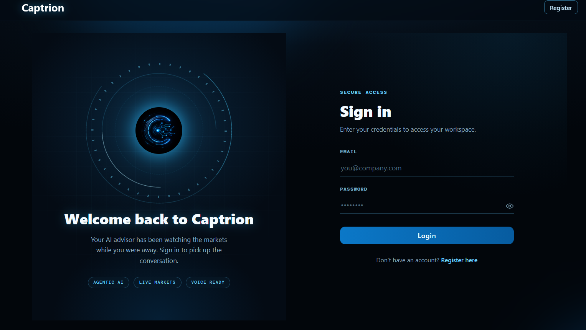

# Captrion

Captrion is a financial advisory platform designed to provide users with data-driven insights for understanding markets, evaluating investments, and managing their portfolios.

## Preview

<p align="center">
  
  <br/>
  
</p>

## Core Capabilities

| Capability | Implementation |
|---|---|
| **RAG** | SEC filings and financial news embedded with BGE, indexed in Pinecone, and used to ground responses with source citations. |
| **FinBERT** | Financial sentiment analysis over retrieved text, feeding aggregated sentiment signals into advisor reasoning. |
| **Machine Learning** | XGBoost for next-week price direction with reliability scoring, plus volatility, Sharpe, drawdown, and Beta analysis. |
| **LLM & Agentic Orchestration** | Deterministic RAG + ML pipeline alongside an agentic mode where the LLM dynamically selects tools. |
| **MCP & External Tools** | Remote MCP integration for live financial data with Tavily-powered real-time web search. |
| **Voice Interface** | Whisper (STT) → agentic reasoning → ElevenLabs (TTS), with multi-turn conversational memory. |
| **Personalization** | JWT authentication with persistent risk profiles, portfolios, watchlists, and conversation history. |

## Tech Stack

**Backend:** Python, FastAPI, SQLAlchemy, PostgreSQL, Docker
**Frontend:** React, TypeScript, Vite, Tailwind CSS, Zustand

## Setup

### Prerequisites

* Python 3.9+
* Node.js 18+
* Docker Desktop
* Git

### Backend

Clone the repository and navigate to the project directory:

```bash
git clone <repository-url>
cd financial-advisor
```

Install the Python dependencies:

```bash
pip install -r requirements.txt
```

Start Docker Desktop, then start the PostgreSQL container:

```bash
docker compose up -d
docker ps
```

Make sure `financial-advisor-db` is running and shows a **healthy** status before continuing.

Start the API server:

```bash
uvicorn app.main:app --reload
```

Wait for:

```text
Application startup complete.
```

Keep the API server running and use a separate terminal for the remaining commands.

### Frontend

Navigate to the frontend directory:

```bash
cd frontend
```

Install dependencies:

```bash
npm install
```

Start the development server:

```bash
npm run dev
```

## API Documentation

Once the backend is running:

**Swagger UI:** `http://127.0.0.1:8000/docs`
**ReDoc:** `http://127.0.0.1:8000/redoc`